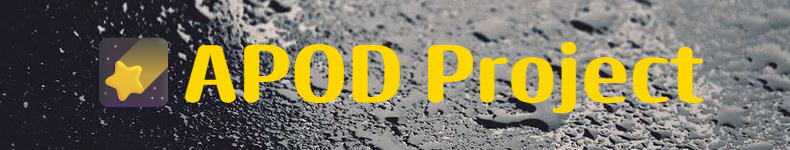
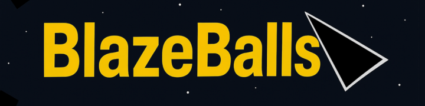
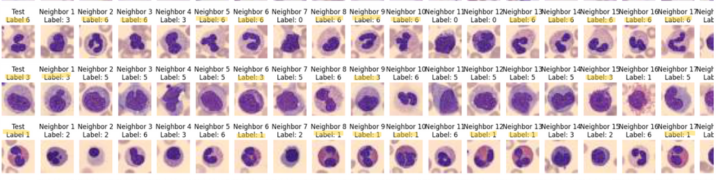

# Hi, I'm Lars 👋

Software engineering student (SDU) strong in **math/algorithms** and **backend/web**.  
Mostly working with **Java** and **Python**. I build small projects to sharpen **JS, APIs, Docker (familiarity), and web scraping**,  
and I occasionally do CTFs with **Brunerne**.

## I like building
- Small, clear **backend services** and API clients
- Robust **scrapers** (pagination, state, retry)
- Simple **web UIs** that are easy to use and test

## Toolbox
Java · Python · JavaScript · React · REST/JSON · SQL/MySQL · Selenium · NumPy · Linux · Git/GitHub · Docker 

## Featured projects

**APOD (Node/Express):** Import NASA APODs by **date range** and **search** across imported entries. Falls back to the standard image when **HD** is unavailable.

**Movies (TMDB scraper + React):** Selenium/BS4 importer with pagination + React UI for **filter** and links to TMDB. Built as a clean, lightweight React UI.

**BlazeBalls (JavaFX + JPMS):** Modular architecture, **delta-time** movement, centralized bullet logic. Simpler codebase → better testability.

**dl25e (NumPy):** From-scratch **FullyConnectedNN** (forward/backprop, ReLU/Softmax, cross-entropy); trained and evaluated on BloodMNIST.

## Now
- Polishing this README and updating old projects.
- Open to a **software internship (backend/web)** - feel free to reach out!

## Contact
📧 lars.kri2@gmail.com · 🌐 [github.com/djarnis2](https://github.com/djarnis2)
